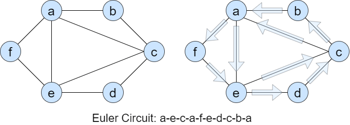

# Problems that can be solved using algorithms - Part 1

As we discussed earlier [what is algorithm](what_is_algorithm_en.md), algorithm is basically a well descripted procedure of doing a **task**, that solves the problem. Almost any kind of work we do in our daily life, can be traced back by the words of _algorithm_.

But then, naturally one question arises, _"Doesn't that mean every kind of problems can be solved using algorithms?"_ The answer to the question is **mostly yes**, problems can be solved if we are given a proper algorithm.

But for the context of this, we confine ourselves with the notion of solving **Computational problems.** The answer to the question is still **Yes**. The challenge is to derive a well descripted algortihm that solves that particular problem.

The article will showcase two types of problems.

* Classical Computer Science problems that can be solved using Algorithms.
* Practical Problems that can be solved using Algorithms.

For the part 1 of this article, we concern ourselves with **Classical Computer Science problems that can be solved using Algorithms.**

Also note that, this list is only for giving you an _illustration_ of the kind of problems that can be solved using **Algorithms**. By no means, this list concerns _every_ problems, as the number is tremendously huge.

---

## Finding the Shortest Path on a graph

---


Look at the above image. There is a set of vertices ${\{1,2,3,4,5,6\}}$, and some edges connecting them. We can call the vertices _cities_, and the edges *Roads* connecting them.

> **What is the shortest path from city ${1}$ to city ${6}$?**

It is obvious in this example that the shortest  path goes ${1->2->5->6}$, which is equal to ${20}$, the only other path ${1->3->4->6}$ equals to ${20}$, which is longer. But as the graph gets bigger, we need an algorithm to solve this.

Algorithms like [Dijkstra's Algorithm](https://en.wikipedia.org/wiki/Dijkstra%27s_algorithm), [Bellman Ford's Algorithm](https://en.wikipedia.org/wiki/Bellman%E2%80%93Ford_algorithm) and [Floyd Warshall's Algorithm](https://en.wikipedia.org/wiki/Floyd%E2%80%93Warshall_algorithm) can solve this problem concering graphs, which will be discussed in details.

---

## Sorting a list of elements

---


When we rearrange some the array ${A = \{a_1,a_2, ... , a_n\}}$, where ${a_i > a_{i-1}}$ (Descending ordering), or ${a_i < a_{i-1}}$ (Ascending ordering), for all ${1 < i < n}$, that arrangement is called a _sorted array_.

In the above example, the array ${22,13,5,7,11}$ is sorted in ascending order ${5,7,11,13,22}$, where ${5<7<11<13<22}$.

There are numerous algroithms for sorting an array, as it is one of the fundamental computational operation. Algorithms like [Insertion Sort](https://en.wikipedia.org/wiki/Insertion_sort), [Merge Sort](https://en.wikipedia.org/wiki/Merge_sort), [Quick Sort](https://en.wikipedia.org/wiki/Quicksort) and [Radix Sort](https://en.wikipedia.org/wiki/Radix_sort) solves the problem, which will be discussed later.

---

## Searching for a Pattern

---


Suppose we are given a _pattern_, we return all the instances of that pattern occuring in our _search_ place.

If you have some programming experience, you can probably come up with the following algorithm:

```C++
//Iterate over all substrings of length pattern.length() of search

PATTERN-MATCHING(pattern, search) 

    array ans = {}
    for i = 1 to search.length
        /*
        substring(i,j) denotes the substring starting 
        at index i with the length of j.
        */
        if pattern == search.substring(i, pattern.length())
            ans.store(i)
    
    return ans
```

---

The problem however with that algorithm is that it runs too slow. For bigger problems, we need a tremendous amount of time.

Algorithms like [Rabin Karp pattern matching algorithm](https://en.wikipedia.org/wiki/Rabin%E2%80%93Karp_algorithm), [Knuth Morris Pratt (KMP) Algorithm](https://en.wikipedia.org/wiki/Knuth%E2%80%93Morris%E2%80%93Pratt_algorithm) can solve this problem with significant improvement. They will also be discussed later.

---

## Finding a circuit of a graph that goes through all the edges

---



A *circuit* of a graph is a _path_ where each edge is used **once and only once**, and it starts and ends at **the same node**. This is also called an [_Eulerian circuit_](https://en.wikipedia.org/wiki/Eulerian_path) of a graph. An illustration is shown above. 

[Depth First Search](https://en.wikipedia.org/wiki/Depth-first_search), a well known graph traversal algorithm can be used to solve this problem.

## Number of ways an amount can be made using some coins

---

Suppose we have some coins ${C = \{c_1, c_2, ... , c_n\}}$, and we wish to make some amount out of it using the coins **Any number of times, including ${0}$.** For example, if ${C = \{1,3,4\}}$, and we wish to make ${amount = 5}$, there are six ways to do it.

* ${1+1+1+1+1}$
* ${1+1+3}$
* ${1+3+1}$
* ${3+1+1}$
* ${1+4}$
* ${4+1}$

There is a well known optimization technique called [_Dynamic Programming_](https://en.wikipedia.org/wiki/Dynamic_programming), so solve this problem efficiently. 

---

There is an overwhelming amount of interesting problems in Computer Science, as well as the algorithms to solve them. The ones listed above are just ${5}$ of them. We will discuss about more algorithms in the upcoming articles.

Part 2: [Problems Solved by Algorithms - Part 2](problems_solved_by_algorithms_part_2_en.md).