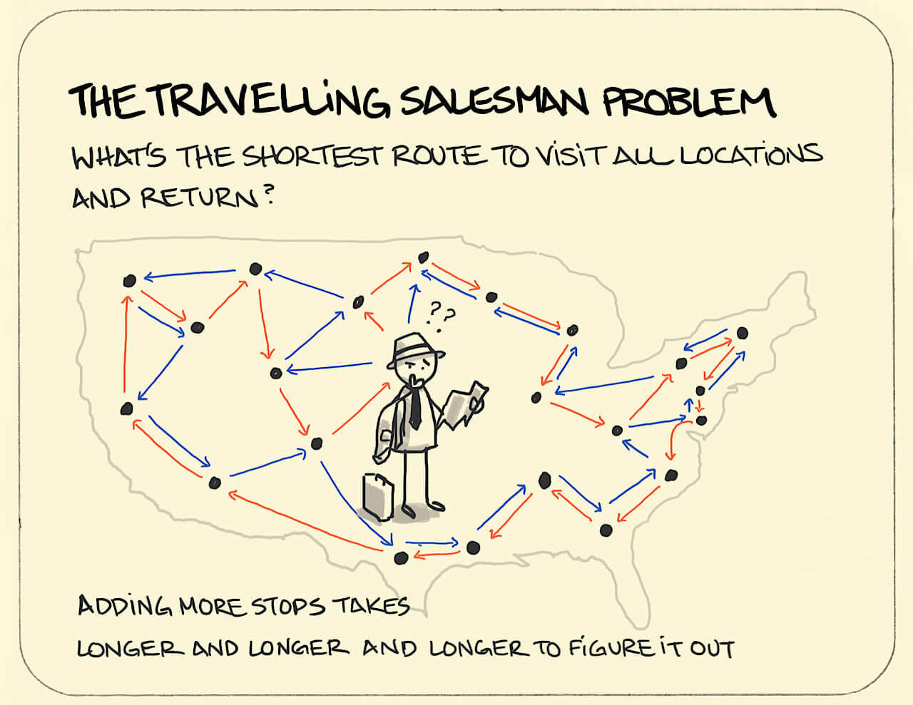

# Problems that can be solved using algorithms - Part 2

This is a continuation of the article [Problems that can be solved using algorithms - Part 1](problems_solved_by_algorithms_part_1_en.md). As we discussed there, numerous problems, mostly Computer Science related and Computational, can be solved conveniently using algortihms. But these are all meaningless to pursue, if it doesn't have any kind of practical implications in real life. Here, we discuss some real life problems that are solved, using algorithms.

All of these problems and implications are built upon a diverse set of _smaller algorithms_, algorithms that usually solve small problems, such as [Sorting](https://en.wikipedia.org/wiki/Sorting). In other words, we can say that an **algorithm** that solves a real life problem can be considered a procedure containing many **smaller algorithms**, that contribute to the bigger problem.

In this article, we will discuss four of them.

## 1. Google Maps

---

The idea of maps is heavily based on [graph theory](https://en.wikipedia.org/wiki/Graph_theory) and it's applications. The most fundamental work of this application is to help us finding the **shortest route** from our starting point to destination. It uses many [Shortest Path Algorithms and it's variants](https://en.wikipedia.org/wiki/Shortest_path_problem) in order to do this task, mostly [Dijkstra's Algorithm](https://en.wikipedia.org/wiki/Dijkstra%27s_algorithm).

## 2. Search Engines

---

Why does it take just a fraction of a second to get results from something as overwhelmingly big as internet?  This is just a work of clever algrotihms implemented. Search Engines like Google use [PageRank Algorithm.](https://en.wikipedia.org/wiki/PageRank)

The key idea of PageRank Algorithms is calculate the **relevance and importance** of a certain website based on the **keywords** searched. It uses advanced _mathematical insights_ and [_sorting_](https://en.wikipedia.org/wiki/Sorting) based on relevance, and a decent amount of [_Graph Theory_](https://en.wikipedia.org/wiki/Graph_theory) notions in order to make this algorithm work.

## 3. Detecting Plagiarism

---

What exactly is plagiarism? The definition from Oxford Languages say:

> the practice of taking someone else's work or ideas and passing them off as one's own.

Naturally, if the work is stolen, we can find similarity between the two patterns. Plagiarism can be concluded if we find a significant amount of similar patterns, thus, searching the whole content for matching pattern is important. 

This is an extensive applciation of [Rabin Karp Pattern Matching Algorithm](https://en.wikipedia.org/wiki/Rabin%E2%80%93Karp_algorithm) and various other algorithms, we will discuss about this algortihm in the upcoming articles.

## 4. Bus Schedules

---

In real world, we have limited resource and time, thus making the most efficient usage of the time is crucial. 

Suppose, a bus has to go through several cities. There are several roads **connecting** each city, each of them has **equal or different** lengths. What might be our **shortest path** such that we visit every city **exactly once**?

Let's represent this as a graph problem.

---

Suppose we have ${n}$ cities, ${cities = \{1, 2, ..., n\}}$, and ${m}$ roads ${roads = \{\{u_1,v_1,w_1\}, ... , \{u_m, v_m, w_m\}\}}$, where ${u_i}$ and ${v_i}$ are two cities **connected by a road**, ${(1 \le u_i, v_i \le n)}$, and ${w_i}$ is the length of the road (Preferably in **Kilometers**).

Let ${W(u, v)}$ be the weight between of the road between two cities ${u}$ and ${v}$, where ${W(u, v) = \infin}$, if there exists no **edges** between these two cities.

We have to find a [permutation](https://en.wikipedia.org/wiki/Permutation) of the sequence ${\{1 , 2 , ... ,n\}}$,  ${C = \{c_1,c_2, ..., c_n\}}$, a cycle, such that:

$${sum = \sum_{i = 1}^{n-1} {W(c_i, c_{i+1})}}$$

Along with ${W(c_n, c_1)}$, is minimized.

---

This is an application of the [Travelling Salesman Problem](https://www.geeksforgeeks.org/travelling-salesman-problem-set-1), which can be optimized using a method called [Dynamic Programming](https://en.wikipedia.org/wiki/Dynamic_programming).

There are myriad real life problems that can be solved using algorithms. Check out the next part [Problems that can be solved using Algorithms - Part 3](problems_solved_by_algorithms_part_3_en.md) for more such examples.