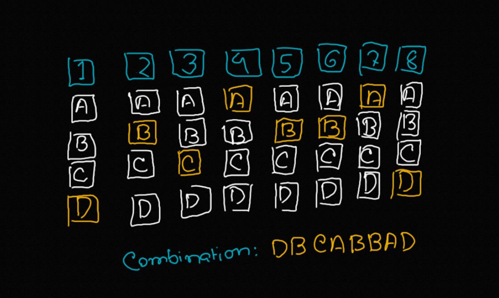
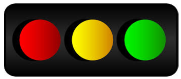

# Problems that can be solved using Algortihms - Part 3

This article is a continuation of the article [Problems that can be solved using algorithms - Part 1](problems_solved_by_algorithms_part_2_en.md). As disucssed earlier, there are abundant applications of algorithms to solve our problems in practical life, the very work of algorithm is to solve a problem using a set of **well defined** procedure. In this article, we discuss four of them.

## 1. Prediction and Estimation Problems

---

Have ,you ever stumbled upon websites like _**Answer these questions and determine your personality**_, or _**Answer these questions to determine your music taste**_? How do they predict these based on these questions? 

It turns out to be that they analyzing every possible [combination](https://en.wikipedia.org/wiki/Combination) of the possible answers using some sort of **key** _exclusive to the question itself_ is the way to do that. However, it's done only using **extensive optimizations**, the raw idea itself is never applicable as it will **slow down** the application too much.

## 2. Traffic Lights

---

A lot of people think that traffic lights are just some timer, that resets and changes it's color at the end of some time stamp. It would have been very silly to actually do it that way. Fortunately, there are some good algorithms that these procedures incorporate.

There are **sensory inputs** that determine the signals’ timing based on the **flow of traffic**. The algorithm is a well-constructed, step-by-step order that directs the traffic appropriately.

## 3. Cryptography Applications

---

[Cryptography](https://en.wikipedia.org/wiki/Cryptography) is basically a set of things concerning computer security. As written in _Wikipedia_,

> cryptography is about constructing and analyzing protocols that prevent third parties or the public from reading private messages.

Cryptographical Applications, are generally applications based on this idea, such as [Computer Passwords](https://en.wikipedia.org/wiki/Password) or [Digital Currency](https://en.wikipedia.org/wiki/Digital_currency), or [encryption](https://en.wikipedia.org/wiki/Encryption). Each of the applications are powered by advanced algorithms.

## 4. Machine Learning

---

[Machine Learning](https://en.wikipedia.org/wiki/Machine_learning) is one of the most diverse fields of Computer Science, and it is mainly fueled by algorithms. The main idea is that it **analyzes data** in order to improve itself through experience, making better decisions and accurate decisions, much like a human. Machine Learning takes solving problems using algorithms to a whole new level, creating a revolution in how we see things.

A tremendous number of interesting problems can be solved using machine Learning algorithms, such as **Facial Recognition**, **Image recognition**, **Speech Recognition**, **Traffic recognition**, **Spam detection**, and many many more.

---

It is impossible to fully discuss the extent to which algorithms can solve problems in such a small article. Wherever there are problems, there are algorithms. Thus, the study of algorithms is one of the **fundamental** in the field of computer science, if one is to truly appreciate the underlying beauty of computation.