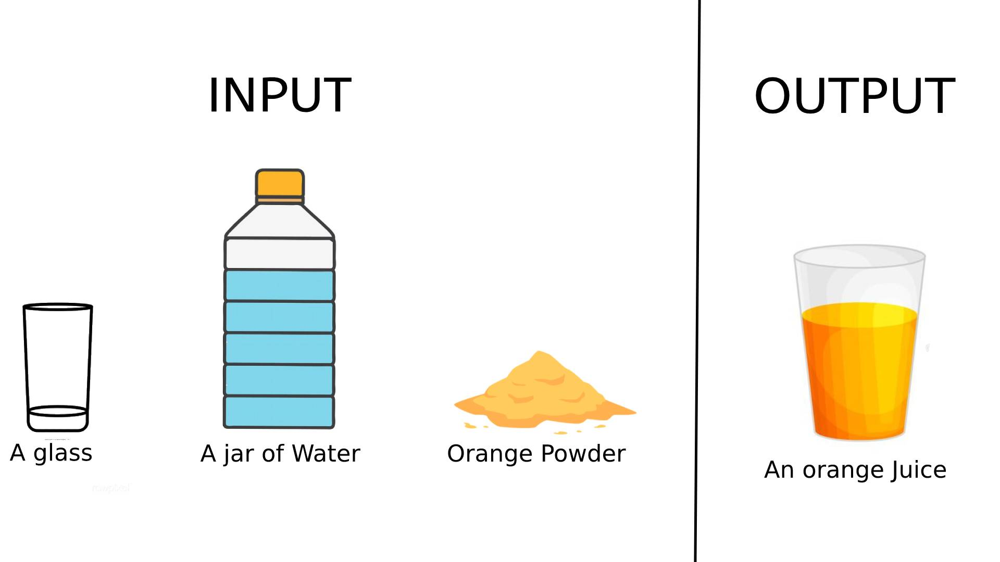

# Introduction to Algortihm

Algorithm is one of the oldest branch of mathematics, a deeply rooted branch that expanded exponentially ever since the age of computing started. Before there were computers, there were algorithms, and now that there are more computers, there are more algorithms. Whenever there were problems to solve, there were algorithms. Now, algorithm has curved itself to be the heart of computing. A topic so influential, naturally arises a question, ***What exactly is algorithm?***

## What is Algorithm?

---

Algorithm, in simple words, is a set of procedure, that should be done, *in order to get a **specified output**, for a given **specified input.*** Suppose you're given a **problem**, or a **task**. You are told to do a set of procedure, that will solve the **problem**, or do the **task**, for all the ***inputs*** imaginable. Then, that **procedure** can be called an **"Algorithm"**.

---

### An Example

Supose, you are given a jar of water, a glass, and a packet of Dried orange powder, and you are told to make a glass of orange juice. **Problematic**, isn't it?

In other words, you are given a *task*, to make, or *"ouptut"* the *orange juice*, using the *inputs* or the *ingredients* you are given.

---

### Input

* A glass
* A jar of water
* Orange Powder

### Output

* A glass of orange Juice

---




It is clear that we will need to follow a thorough procedure in order to make that juice. And that, precisely is our **algorithm** in this case.

```C++
Procedure:
1. Pour water into the glass.
2. Take required amount of orange powder.
3. Stir for 1 minute.
```

As we can see, this Procedure ***Solves*** the task, by making the ***input*** undergo through it, to produce an *output*. This, therefore, can be considered an algorithm.


